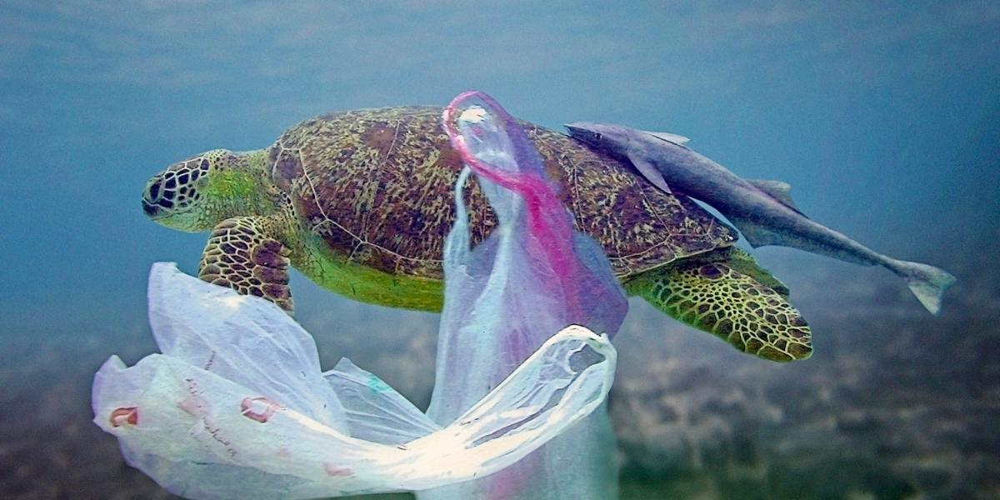
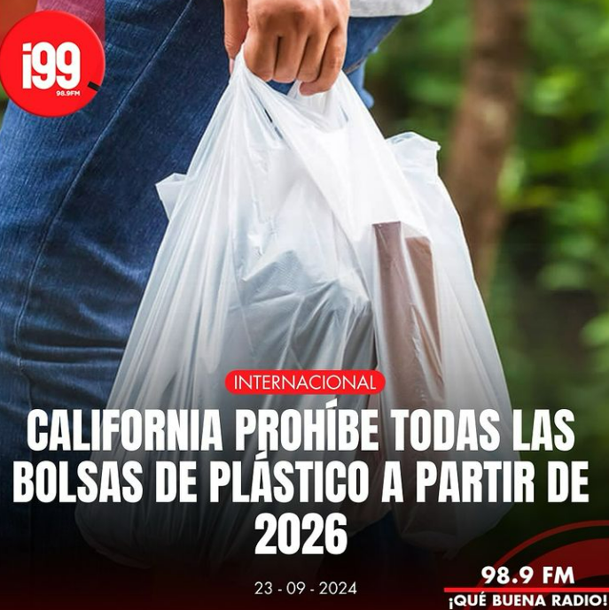
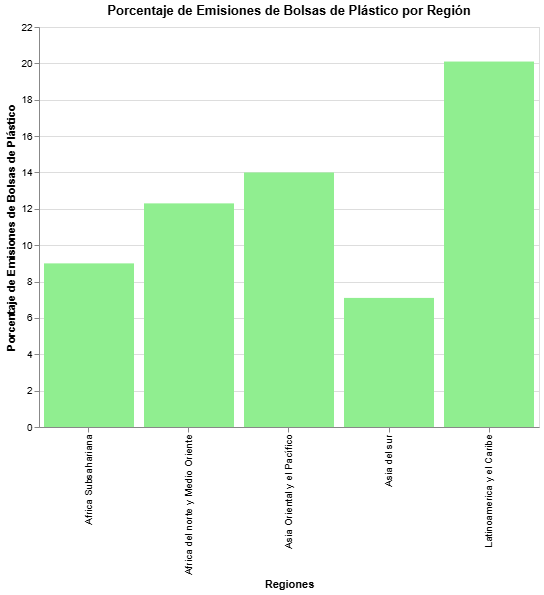
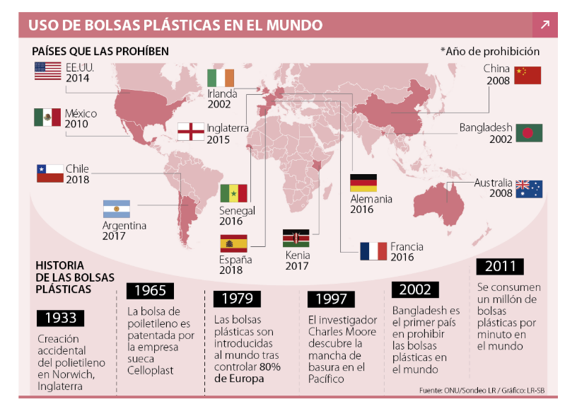

# Crónica de la emisión de bolsas de plásticos a nivel mundial
María José Jiménez

 

En 2018, Chile dio un paso decisivo al prohibir las bolsas plásticas en grandes tiendas y supermercados, siendo el primer país de América Latina en adoptar una medida de este tipo. 
La ley N.º 21.100 de prohibición de bolsas plásticas , marcó una reducción significativa en el uso de bolsas plásticas. Sin embargo, a pesar de los avances en Chile, Latinoamérica y el Caribe seguían representando el 20.1% de las emisiones globales de bolsas plásticas en 2019. 
Este dato resalta un desafío más profundo: el problema del plástico no se soluciona con medidas aisladas. 
   
El ejemplo de California en 2016 nos recuerda que una ley por sí sola no garantiza el cambio. Aunque las bolsas de plástico de un solo uso fueron prohibidas, el uso de bolsas "reutilizables" más gruesas generó un aumento en los desechos. Lo que aprendemos de este caso es claro: cambiar la mentalidad de los consumidores y asegurar infraestructuras de reciclaje son pasos esenciales.

[Información de ley de California](https://laopinion.com/2024/05/27/senado-de-california-vota-a-favor-de-proyectos-de-ley-para-prohibir-bolsas-de-plastico-reciclables/)

La visualización atómica nos permite entender, cómo se distribuyen las emisiones de bolsas plásticas por región. Latinoamérica y el Caribe lideran con el 20%, seguidos por Asia Oriental y el Pacífico con el 14%, Por lo que apesar de los esfuerzos, la región enfrenta un desafío mayor que con solo medidas nacionales no se pueden resolver.

 

En Asia, países como India, Bangladesh y China han adoptado leyes significativas para combatir el plástico, pero la lección global es clara: se necesita una acción coordinada a nivel regional, que combine leyes, educación ambiental y reciclaje, para reducir verdaderamente las emisiones de plásticos y proteger nuestros océanos.

[Información de ley de India](https://infinitylearn.com/surge/english/article/swachh-bharat-abhiyan-single-use-plastic-ban/#:~:text=The%20Ministry%20of%20Environment%20proposed,of%20the%20nation%20through%20broadcasting.)

**En India:** En 2022, el gobierno prohibió productos plásticos de un solo uso, incluidas bolsas plásticas, como parte de la campaña Swachh Bharat Abhiyan (India Limpia).

[Información de ley de Bangladesh](https://www.aa.com.tr/es/mundo/banglad%C3%A9s-l%C3%ADder-mundial-en-la-prohibici%C3%B3n-de-bolsas-de-pl%C3%A1stico/1367626)

 **Bangladesh:**  fue el primer país en el mundo en prohibir bolsas plásticas en 2002, luego de que estudios demostraran que estas bolsas bloqueaban el drenaje y empeoraban las inundaciones durante los monzones.  

[Información de ley de China](https://cms.law/en/int/expert-guides/plastics-and-packaging-laws/china)

 **China:**  En 2008, se introdujo una regulación que prohibió las bolsas plásticas ultrafinas y exigió un cobro por el uso de bolsas más gruesas. En 2020, el gobierno anunció un plan para eliminar gradualmente las bolsas plásticas en supermercados y servicios de entrega para 2025.  

La experiencia de Chile, aunque ha sido significativa, no ha logrado disminuir las emisiones en la región debido a la falta de una estrategia conjunta. Por otro lado, los avances en Asia ofrecen una guía sobre cómo integrar políticas, cambios de comportamiento y mejores infraestructuras de reciclaje.

La solución no es simple: se necesita una combinación de leyes estrictas, educación ambiental, alternativas accesibles y una gestión de residuos eficiente. Solo con un enfoque coordinado y multifacético podremos lograr una reducción significativa en las emisiones de bolsas plásticas y proteger los océanos y el medioambiente global.

