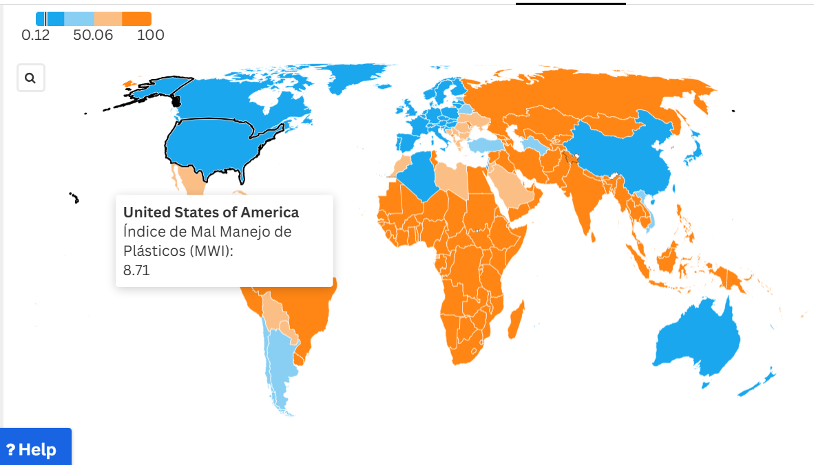
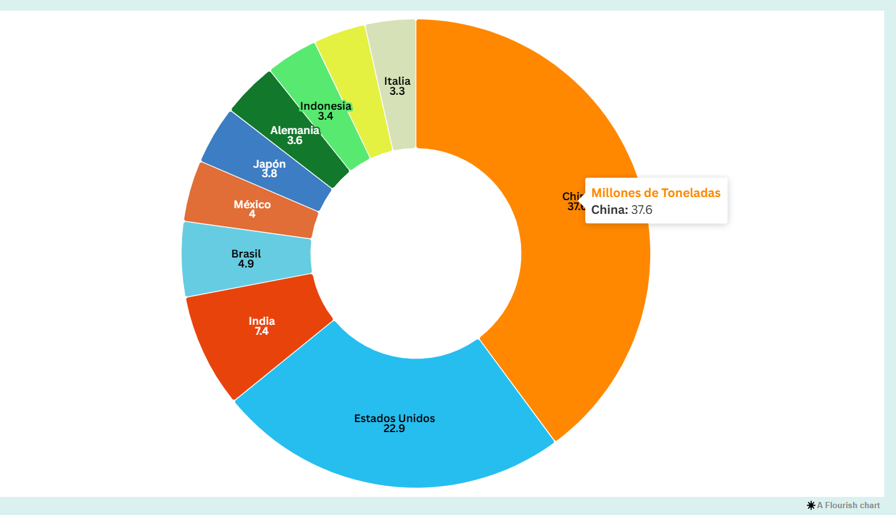
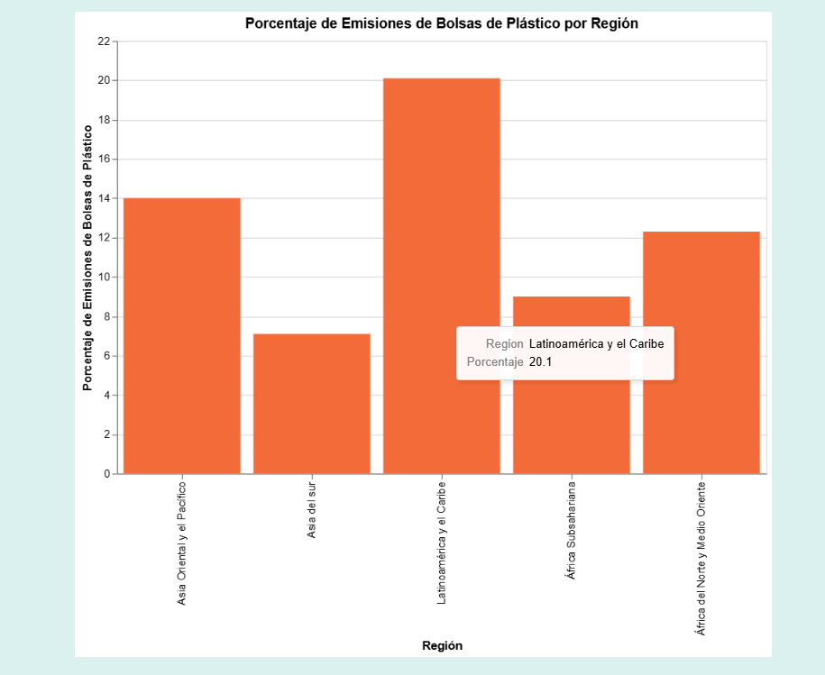

# Entrega 06 
Hola somos María José Jiménez, Victoria Silva y Blanca Ward.

**Nuestra webstory**, The Ocean Guard brinda información de las bolsas de plástico en los océanos y específicamente da a conocer sobre las distintas iniciativas de parte de ONG`S, leyes y gobiernos para reducir esta problemática. 

A lo largo del semestre fuimos comprobando que nuestra hipótesis era correcta, las bolsas plásticas son uno de los mayores contaminantes de los océanos, pero a través de políticas efectivas, iniciativas de ONG, variedades de leyes y cambios en los hábitos de consumo, es posible disminuir su impacto y proteger el medio ambiente. En un principio no sabíamos si efectivamente íbamos a estar bien con lo que creíamos, pero después de mucha investigación corroboramos la información. Efectivamente, a lo largo de los años se han implementado distintas cosas, como por ejemplo leyes o proyectos que sí han ayudado a disminuir este consumo de bolsas plásticas, por ende también la contaminación de ellas en los océanos. 

A pesar de que aún falta bastante para solucionar el problema de fondo, se puede decir que estas cosas han ayudado a disminuir el impacto en el medio ambiente. 
Por otro lado, respecto a las preguntas a responder que eran las siguientes: 

- **¿Qué efectos tienen las bolsas plásticas en los océanos y las especies marinas?**
- **¿Cuáles son los países más responsables de la contaminación plástica?**
- **¿Qué leyes y políticas han sido implementadas para combatir esta problemática a lo largo del mundo?**
- **¿Qué impacto han tenido estas leyes en la reducción del uso de bolsas plásticas?**

A lo largo del reportaje se van contestando solas, dimos toda la información necesaria para que así las preguntas no queden sin respuestas. Creemos que son respuestas muy completas que se van complementando entre sí para dar la mayor información posible sobre la temática. 

**Titular:** La batalla contra las bolsas plásticas en los océanos: iniciativas para salvar el planeta
De acuerdo al titular, creemos que está bueno y completo, sirve para que las personas de inmediato se den cuenta de lo que van a leer a continuación. También a lo largo del reportaje toda la información va de la mano con el titular, tratamos de nunca irnos por las ramas y abrace información que no iba a servir o iba a aburrir al lector. 

**Nuestra evolución del trabajo semestral**, como ya hemos mencionado antes, ha tenido altos y bajos. En un principio teníamos un tema muy amplio que nos confundía  y no nos dejaba avanzar y realizar el reportaje de manera correcta. Por lo que decidimos especificar el tema y centrarnos simplemente en las bolsas de plásticos. De acuerdo al trabajo en sí, ciertas entregas se nos hicieron bastante pesadas, pero como buen equipo que somos, logramos distribuir el trabajo en donde todas cooperamos con lo que podíamos. 

Estamos muy felices con los resultados, jamás creímos que íbamos a poder crear lo que hoy en día es nuestra webstory, estamos muy orgullosas de todo lo que hemos aprendido. 

- **Información de visualizaciones atómicas:**

**Mapa interactivo:** 
Para este gráfico, decidimos utilizar los datos directos de [WorldBank](https://datacatalog.worldbank.org/search/dataset/0038272), ellos tenían este gráfico directamente entonces no cambiamos nada. Este mapa mundial muestra por cada país el índice del mal manejo de plásticos, el nivel de mal manejo de plásticos, que va de muy bajo a muy alto, y finalmente el consumo total de plásticos por país en toneladas.

Lo elegimos porque creemos que brinda información relevante que se complementa, pues el mapa contiene información sobre el índice del mal manejo de plásticos en los diferentes países del mundo. Información que se complementa con la introducción que se está dando en el reportaje. También en el caso de que las personas no quieran o no tengan tiempo de leer el reportaje, simplemente viendo el mapa e interactuando con él puede informarse sobre la problemática. 

**GRÁFICOS:**
1. **Principales países contaminadores de plástico:**
Datos obtenidos en [WorldReview](https://worldpopulationreview.com/country-rankings/plastic-pollution-by-country)

El primer gráfico interactivo que realizamos, lo elegimos para poder mostrar cuales son los principales países que contaminan plásticos en el mundo. Este lo hicimos con formato circular para así, exponer la información de manera más entretenida y no solo texto. Aprovechando que solo necesitamos poner una cifra y un  país, así no exagerar con más líneas de información. 

2. **Gráfico de Barras Altair:**
Contaminación plástica en océanos por región, los datos los obtuvimos de 
[Our World in Data](https://ourworldindata.org/grapher/waste-items-ocean-region), que si bien entrega cifras de distintos tipos de plásticos, lo reducimos a solo emisisones de bolsas plásticas por región.

 Este gráfico, lo elegimos para poder dar a conocer dónde podemos encontrar más plásticos en los océanos. Este está separado por regiones y al pincharlos podemos conocer exactamente su magnitud. Lo elegimos, porque así no solo es texto, sino que el espectador puede conocer la ubicación exacta donde hay más contaminación plástica por país y al igual que el gráfico anterior, lo hacemos de una manera más simple, ya que tanto texto aburre y desconcentra a quien esté mirando la página. 

**Botones:**

 

            <a href="https://theoceancleanup.com/" target="_blank"><button class="ngo-button">The Ocean Cleanup</button></a>
            <a href="https://www.cleanseas.org/es" target="_blank"><button class="ngo-button">Clean Seas</button></a>
            <a href="https://plasticbank.com/" target="_blank"><button class="ngo-button">Plastic Bank</button></a>
        

Los botones que usamos sirven para llevar directamente  a las páginas de las tres ONG que analizamos dentro del reportaje. Quisimos utilizarlos, para que así las personas que quieran seguir informándose sobre el tema lo puedan hacer encontrando información aún más específica. 

**Preguntas y respuestas:**
    

        <button class="faq-question">¿Qué alternativas puedo usar en lugar de bolsas plásticas?</button>
        
Usa bolsas reutilizables de tela, algodón orgánico o materiales reciclados. Mantén una o dos siempre disponibles y compra productos a granel.

    

    

        <button class="faq-question">¿Cómo puedo reutilizar o aprovechar las bolsas plásticas que ya tengo?</button>
        
 Reutiliza las bolsas plásticas para otros fines, como guardar basura o empacar objetos pequeños. 

    

    

        <button class="faq-question">¿Qué políticas o prácticas pueden ayudar a reducir el uso de plásticos?</button>
        
Apoya leyes que restrinjan el uso de bolsas plásticas y opta por marcas que usen empaques sostenibles.

       

- **Base de datos:**
[Fundacionaquae](https://www.fundacionaquae.org/wiki/5-alternativas-a-las-bolsas-de-plastico/)
|
[Guía de Residuos](https://mma.gob.cl/wp-content/uploads/2018/08/Guia-de-Educacion-Ambiental-y-Residuos)

 
 Esta sección de preguntas y respuestas interactivas la decidimos usar para así contestar las preguntas típicas que creemos que las personas se hacen al terminar de leer el reportaje. La idea es seguir brindando información que pueda ayudar a reducir esta problemática de parte de los usuarios. Se dan tres recomendaciones para reducir el uso de bolsas plásticas. 

**Comentario adicional:** Aunque cada integrante se enfocó en áreas específicas, todas estuvimos siempre participando y pendientes del trabajo de las demás, asegurando que la webstory se desarrollara de manera colaborativa y eficiente.

A continuación, se detalla la participación de cada integrante del equipo en los diferentes elementos de la webstory:

<!DOCTYPE html>
<html lang="es">
<head>
    <meta charset="UTF-8">
    <meta name="viewport" content="width=device-width, initial-scale=1.0">
    <title>Participación en la Webstory</title>
</head>
<body>
    <h1>Participación en la creación de la Webstory</h1>
    <table border="1" cellpadding="10" cellspacing="0">
        <thead>
            <tr>
                <th>Elemento</th>
                <th>María José</th>
                <th>Victoria</th>
                <th>Blanca</th>
            </tr>
        </thead>
        <tbody>
            <tr>
                <td>Diseño</td>
                <td>-</td>
                <td>-</td>
                <td>1</td>
            </tr>
            <tr>
                <td>Códigos</td>
                <td>1</td>
                <td>-</td>
                <td>-</td>
            </tr>
            <tr>
                <td>Página</td>
                <td>1</td>
                <td>-</td>
                <td>-</td>
            </tr>
            <tr>
                <td>README.md</td>
                <td>-</td>
                <td>1</td>
                <td>-</td>
            </tr>
            <tr>
                <td>Reportaje</td>
                <td>-</td>
                <td>1</td>
                <td>1</td>
            </tr>
            <tr>
                <td>Gráficos</td>
                <td>1</td>
                <td>1</td>
                <td>1</td>
            </tr>
        </tbody>
    </table>

